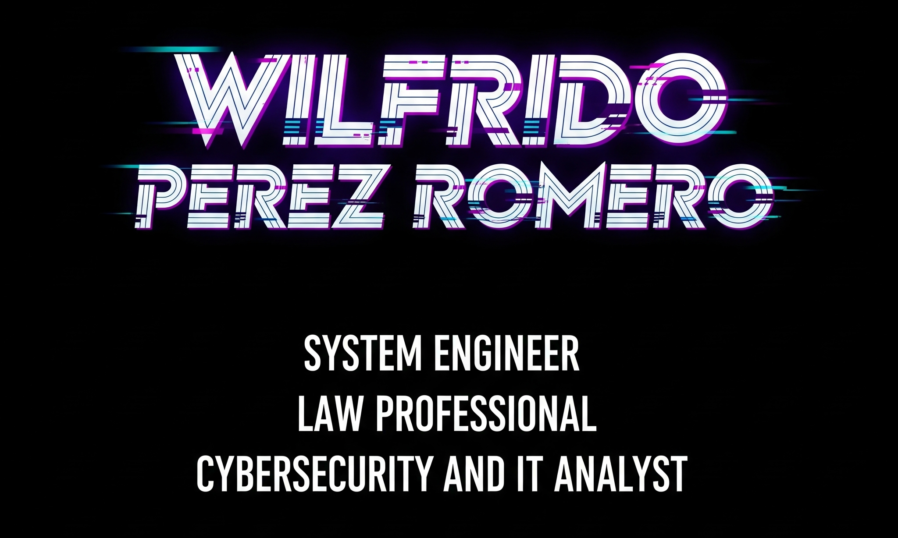

# ¡Hola, soy Wilfrido! 👋

## Bienvenido a mi espacio.


_Puedes conectar conmigo en [LinkedIn](https://www.linkedin.com/in/wilfridocostarica)._

Aquí comparto 💻 proyectos, ✨aspiraciones como 👨‍💻 Ingeniero de Sistemas, ⚖️ Profesional del Derecho y 🛡️experto en Ciberseguridad y TI. También encontrarás contenido valioso sobre una variedad de temas :octocat: con el objetivo de retribuir a la comunidad y 🤝apoyar el desarrollo profesional y personal de todos.

---

### Mis Proyectos y Áreas de Interés:

| Categoría             | Descripción                                                                                               |
| :-------------------- | :-------------------------------------------------------------------------------------------------------- |
| 🚀 **Git & GitHub** | [Explora mis recursos sobre control de versiones y colaboración.](https://github.com/Echo506/Git-Github/blob/main/GIT-GITHUB.md) |
| 🐍 **Python** | [Descubre mis proyectos y scripts en Python.](https://github.com/Echo506/Python/blob/main/GIT-Python.md)         |
| 🗄️ **SQL** | [Sumérgete en mis bases de datos y consultas SQL.](https://github.com/Echo506/SQL/blob/main/Git_SQL.md)             |
| 📊 **Splunk** | [Análisis de datos y seguridad con Splunk.](https://github.com/Echo506/Splunk/blob/main/Git-Splunk.md)          |
| ⚔️ **Metasploit** | [Herramientas y técnicas para pruebas de penetración.](https://github.com/Echo506/Metasploit/blob/main/Git-Metasploit.md) |
| 🛡️ **Threat Intel** | [Conoce mi trabajo sobre inteligencia de amenazas (MITRE ATT&CK).](https://github.com/Echo506/Threat-Intelligence/blob/main/MITRE%20ATT%26CK.md) |

---

### Mis Herramientas:

| Herramienta        | Descripción                                                                                               |
| :----------------- | :-------------------------------------------------------------------------------------------------------- |
| 🔒 **Infra-Sec-Check** | [Herramienta para verificar la seguridad de la infraestructura.](https://github.com/Echo506/infra-sec-check)      |
| 🔎 **Offensive Scan Tool** | [Mi herramienta para escaneo ofensivo.](https://github.com/Echo506/offensive-scan-tool)                             |
| 🚨 **SSH Detector** | [Sistema de alerta para detecciones SSH.](https://github.com/Echo506/ssh-detector)                               |

---

### Mis Habilidades Lingüísticas:

| Idioma    | Descripción                                                                                               |
| :-------- | :-------------------------------------------------------------------------------------------------------- |
| 🇫🇷 **Francés** | [Recursos y proyectos relacionados con el idioma francés.](https://github.com/Echo506/French/blob/master/Git-French.md)   |
| 🇧🇷 **Portugués** | [Contenido y aprendizaje en portugués.](https://github.com/Echo506/Portuguese/blob/main/GIT-Portuguese.md) |
| 🇨🇳 **Chino** | [Mis avances y recursos en el idioma chino.](https://github.com/Echo506/Chinese/blob/master/GIT-Chinese.md)   |
```

